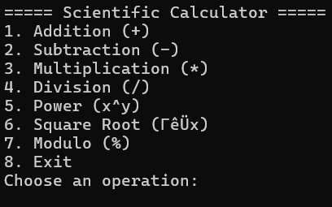
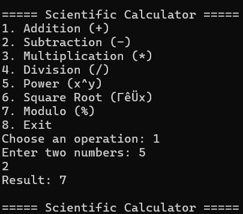
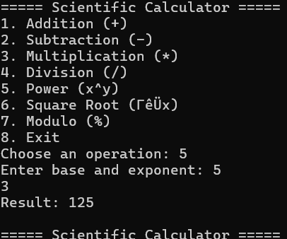

## 📸 Screenshots

### 🔹 Main Menu


---

### 🔹 Basic Operations Example


---

### 🔹 Power Operation Example


# 🔢 Scientific Calculator in C++

A powerful and user-friendly calculator built using **C++**, supporting basic and advanced mathematical operations.

---

## 🚀 Features

- Basic operations: Addition, Subtraction, Multiplication, Division
- Scientific operations:
  - Power (x^y)
  - Square root
  - Logarithm (base 10 and natural)
  - Trigonometric functions (sin, cos, tan)
- User-friendly console UI
- Infinite loop until exit for continuous usage

---

## 🛠️ How to Run

### 🔧 Requirements:
- C++ Compiler (g++, clang++, etc.)

### ▶️ Compile and Run:

```bash
g++ Calculator.cpp -o Calculator
./Calculator
