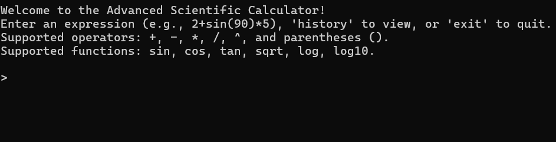
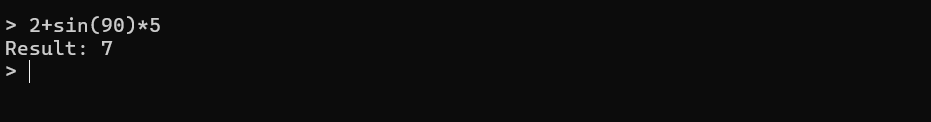
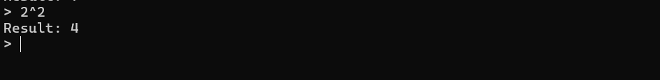
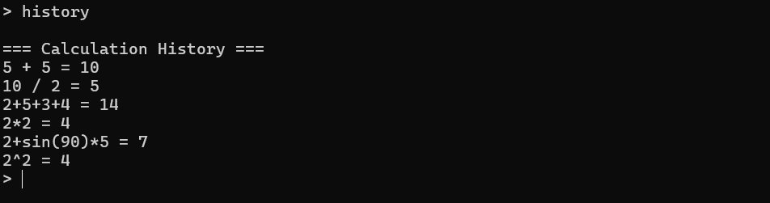
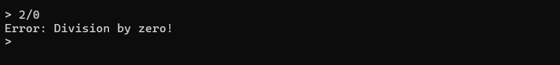

# Advanced Scientific Calculator (C++)

A command-line scientific calculator built in C++ with full expression parsing, scientific functions, persistent history, and robust error handling.

## Features
- Expression parsing for complete formulas, e.g., `2 + 3 * 4 / (5 - 1)`
- Correct order of operations (BODMAS/PEMDAS)
- Scientific functions:
  - `sin(x)`, `cos(x)`, `tan(x)` in degrees
  - `sqrt(x)` square root
  - `log(x)` natural logarithm
  - `log10(x)` base-10 logarithm
- Power operator: `a ^ b`
- Persistent history in `data/history.txt`
- Error handling for invalid input, division by zero, and domain errors

## Folder Structure

SCIENTIFICCALCULATOR
│
├── src/
│   └── Calculator.cpp        
│
├── assets/
│   ├── Main-interface.png
│   ├── Operations.png
│   ├── Power-Operations.png
│   ├── History.png
│   └── Error-Handling.png
│
├── data/
│   └── history.txt
│
├── .gitignore
├── README.md
└── LICENSE  (optional)

## Screenshots

### Main Interface

### Basic Operations

### Power Operation

### History Feature

### Error Handling

## Build and Run

**Requirements:**
- C++17 compiler (g++/clang++)
- On Windows: MinGW-w64 recommended

**Compile:**
- Windows:

> Ensure the program can write to `data/history.txt`.  
> In an IDE, set the working directory to the project root.

## Usage
- Enter expressions:
- `2 + 3 * 4`
- `(5 + 7) / 3`
- `2 ^ 8`
- Scientific functions (degrees for trig):
- `sin(30)`, `cos(60)`, `tan(45)`
- `sqrt(16)`, `log(2.7182818)`, `log10(1000)`
- Show history:
- `history`
- Use last answer:
- `5 * ans`
- Exit:
- `exit` or `quit`

## Error Handling
Descriptive messages for:
- Invalid syntax or unknown tokens
- Division by zero
- Domain errors like `sqrt(-1)`, `log(0)`, `tan(90)`
- Mismatched parentheses

## Implementation Notes
- Tokenizer + Shunting-yard algorithm for expression parsing
- Postfix evaluation using a stack
- Trigonometric inputs converted to radians internally
- History appended to `data/history.txt` and loaded on startup

## License
MIT License — see `LICENSE` file.
